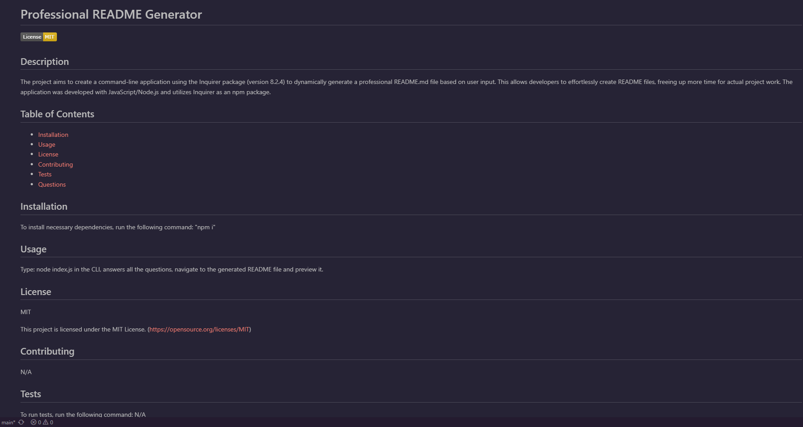

# Professional README Generator


## Table of Contents

- [Description](#description)
- [Code Languages](#code-languages)
- [Installation](#installation)
- [Usage](#usage)
- [License](#license)

## Description

The project aims to create a command-line application using the Inquirer package (version 8.2.4) to dynamically generate a professional README.md file based on user input. This allows developers to effortlessly create README files, freeing up more time for actual project work. The application was developed with JavaScript/Node.js and utilizes Inquirer as an npm package. 


## Code Languages and Runtime

- JavaScript/ Nodejs


## Installation

In order to be able to run the applicaton you are required to do the following installation:

- Install Nodjs on your computer by downloading it from their website here, https://nodejs.org/en.
- If you are not sure how to install it. Click here for the instruction, https://coding-boot-camp.github.io/full-stack/nodejs/how-to-install-nodejs.
- Download/ clone the GitHub repo 
- Install npm (Node Package Manager) inside the repo by typing the following code in the command line:
```bash
 $ npm install
 ```


## Usage

To use the application,
- Watch the guide video by clicking the link here: https://drive.google.com/file/d/1MHTbz1pqdGKrkB4UYTTfOhWUTo2Ho4ha/view


Preview Generated README File:



## License

This project is under the MIT License.


